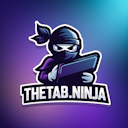

# TheTab.Ninja

**TheTab.Ninja** by [kodar.ninja](https://kodar.ninja/) is an open-source browser extension that transforms your new tab into a fully customizable launch page. Manage your bookmarks and open tabs effortlessly while keeping your data private by syncing through your own GitHub repository—no external servers required.

## 🆕 What's New in Latest Updates

### ✨ Major Feature Additions
- **🧘 Zen Mode:** Immersive distraction-free experience with elegant clock display and search
- **🏷️ Spaces Management:** Organize collections into workspaces (work, personal, hobbies, etc.)
- **🔄 Collection Sorting:** Multiple sorting options including name, last modified, and custom ordering
- **📱 Mobile Optimization:** Complete mobile responsive design with touch-friendly interface
- **🎨 Enhanced UI:** Beautiful dialog designs and improved visual consistency

### 🔧 Technical Improvements
- **🔒 Enhanced Security:** Improved GitHub sync with robust merge conflict resolution
- **💾 Reliable Sync:** Spaces now sync properly with soft-delete functionality
- **⚡ Performance:** Optimized search functionality and UI responsiveness
- **🎯 Better UX:** Keyboard shortcuts, hover effects, and improved navigation

## Features

### 🚀 Core Features
- **Custom New Tab Page:** Replace your default new tab with a personalized dashboard.
- **Bookmark & Tab Management:** Organize your bookmarks and drag & drop your open tabs with ease.
- **GitHub Sync:** Securely sync your data using your own GitHub repository with enhanced security.
- **Data Import/Export:** Easily import collections from Toby and export your settings for backup or sharing.
- **Collaboration:** Share repositories with friends or colleagues for seamless collaboration.

### 🎨 User Interface & Experience
- **Zen Mode:** Distraction-free mode with clock display and search functionality. Scroll down to see Collections
- **Dark Mode Support:** Seamlessly switch between light and dark themes
- **Mobile Responsive Design:** Optimized interface for mobile devices with touch-friendly interactions
- **Custom Background Support:** Choose from predefined wallpapers or upload your own custom images
- **Enhanced Dialog Design:** Beautiful, consistent dialogs for creating and editing bookmarks

### 📱 Mobile Enhancements
- **Optimized Mobile Layout:** Responsive design that adapts to mobile screen sizes
- **Touch-Friendly Controls:** Mobile-optimized buttons and navigation
- **Pane Toggle System:** Easy access to side panels on mobile devices
- **Zen Mode Disabled on Mobile:** Automatic fallback for better mobile experience

### 🔍 Advanced Search & Navigation
- **Powerful Search Function:** Filter collections and bookmarks with advanced operators
- **Quick Search Shortcuts:** Google search with `?` prefix and ChatGPT search with `!` prefix
- **Zen Search Box:** Dedicated search functionality within zen mode
- **Keyboard Shortcuts:** Full keyboard navigation support including Escape key handling

### 🏷️ Spaces Management
- **Collection Spaces:** Organize collections into different spaces (work, personal, etc.)
- **Drag & Drop to Spaces:** Move collections between spaces with intuitive drag and drop
- **Space Filtering:** View collections by specific space for better organization
- **Robust Sync:** Spaces now sync reliably across devices with soft-delete functionality

### ⚙️ Collection Management
- **Flexible Sorting Options:** Sort collections by name (A-Z, Z-A), last modified (newest/oldest), or user-defined position
- **Drag & Drop Reordering:** Intuitive collection reordering when in user-defined sort mode
- **Smart Position Management:** Automatic position updates when collections are moved
- **Enhanced Security:** Improved GitHub sync with better merge conflict resolution

### 🔗 Deep Links & Desktop Shortcuts
- **Deep links:** open a specific collection, space, tag or search via URL parameters (`?collection=`, `?space=`, `?tag=`, `?q=`, `&launch=1`)
- **Drag to desktop:** drag a collection (or the search-results chip) to your desktop to create a self-contained launcher file — double-click it to open just that collection (Chrome/Edge drag-out; Firefox via the "Save desktop shortcut" menu item)
- **Tool bridge:** launcher files embed machine-readable JSON so other tools can consume your collections — see **[DEEPLINKS.md](DEEPLINKS.md)**

## Search & Filter Function

TheTab.Ninja comes with a powerful search feature designed to help you quickly locate the content you need:

### 🔍 Search Operators
1. **Search Field:** At the top of your new tab page, you'll find a search field that filters content in real time as you type.
2. **Search Collections:** Type a `#` followed by a keyword to filter only your collections. For example:  
   `#work` will display all collections that include "work" in their name.
3. **Search Bookmarks:** Simply enter a keyword without any prefix to filter bookmarks within each collection. This allows you to quickly locate specific bookmarks across your collections.
4. **Global Search:** Type a `%` followed by a keyword to search through both collections and bookmarks. For example:  
   `%project` will highlight all items containing "project."
5. **Multiple Keywords:** Use the pipe symbol (`|`) to separate multiple search terms and perform an OR-search. For example:  
   `#blue|red` shows collections with either "blue" or "red" in the name.

### 🚀 Quick Search Shortcuts
6. **Google Search:** Type `?` followed by your search query to instantly search Google. For example:  
   `?weather today` will open Google search for "weather today" in a new tab.
7. **ChatGPT Search:** Type `!` followed by your query to search ChatGPT. For example:  
   `!explain quantum computing` will open ChatGPT with your query.

### 🧘 Zen Mode Search
8. **Zen Search Box:** When in zen mode, use the dedicated search box that appears with a beautiful overlay interface.
9. **Keyboard Navigation:** Full keyboard support with Escape key to return to zen initial screen.

These tools allow you to efficiently navigate through large amounts of data to find exactly what you need.

## Installation

### Chrome
Install [TheTab.Ninja](https://chromewebstore.google.com/detail/thetabninja/bnmjmbmlfohkaghofdaadenippkgpmab) directly from the Chrome Web Store.

### Firefox 🦊
TheTab.Ninja also runs on Firefox (MV3), including a **sidebar mode** so you can keep your collections open next to any page. Build it yourself with `./build.sh firefox` and load it via `about:debugging`, or see **[FIREFOX.md](FIREFOX.md)** for full build, install and porting details (tab groups need Firefox 139+; GitHub sync works out of the box).

### Microsoft Edge
TheTab.Ninja runs fully on Edge too, including tab groups and an Edge **side panel** mode. Build with `./build.sh edge` and load via `edge://extensions` (Developer mode → Load unpacked). See **[EDGE.md](EDGE.md)** for details, including the one-time OAuth setup needed for Google Drive sync (GitHub sync works out of the box).

## 🚀 Getting Started

1. **Install the Extension:** Download and install TheTab.Ninja from the Chrome Web Store.
2. **Configure GitHub Sync:** Enter your GitHub repository details in the extension settings for cross-device synchronization.
3. **Create Collections:** Organize your bookmarks into collections for different topics or projects.
4. **Set Up Spaces:** Create spaces to group collections (e.g., "Work", "Personal", "Learning").
5. **Customize Your Experience:** 
   - Choose your preferred background from the gallery or upload a custom image
   - Enable dark mode if preferred
   - Try zen mode for a distraction-free browsing experience
   - Set up collection sorting preferences

## ⌨️ Keyboard Shortcuts

### 🔍 Search Shortcuts
- **`?` + query:** Instant Google search
- **`!` + query:** Quick ChatGPT search
- **`#` + term:** Filter collections only
- **`%` + term:** Global search (collections + bookmarks)
- **`term1|term2`:** OR search with multiple terms

### 🧘 Zen Mode
- **Escape:** Return to zen initial screen from search
- **Ctrl/Cmd + Enter:** Quick save in dialogs
- **Escape:** Close dialogs and modals

### 📱 Mobile Features
- **Touch-optimized:** All interactions work smoothly on mobile devices
- **Responsive design:** Automatic layout adaptation for different screen sizes
- **Pane toggles:** Easy access to settings and spaces on mobile

## License

This project is licensed under the [CC BY-NC-ND 4.0](LICENSE).

## Support

If you enjoy using TheTab.Ninja, please consider support
